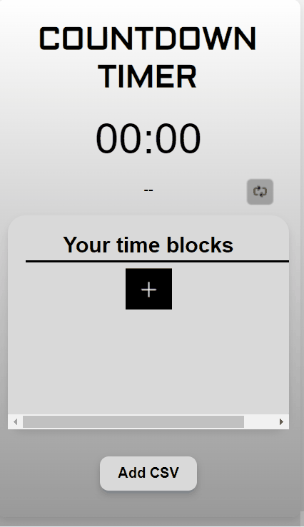
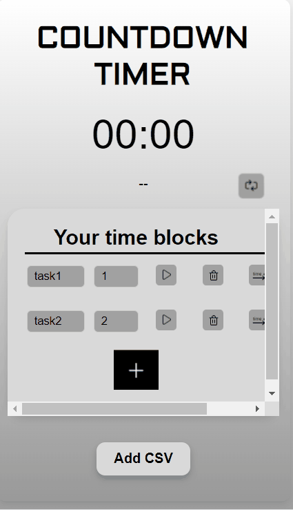
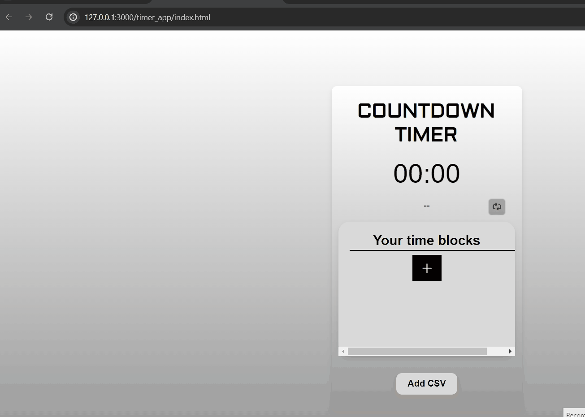
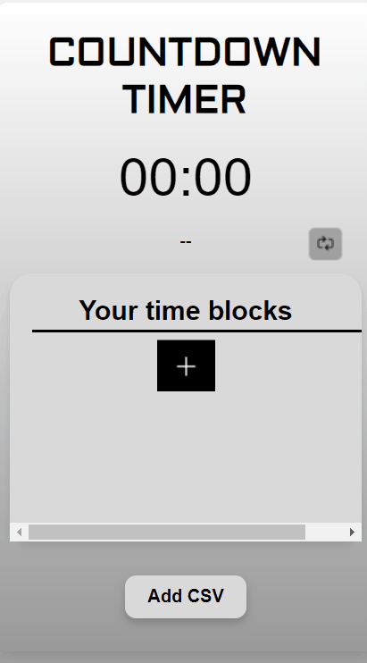
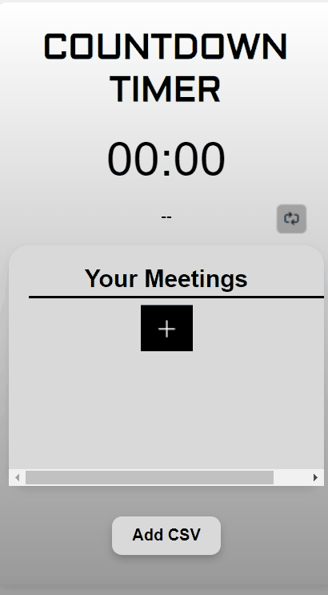
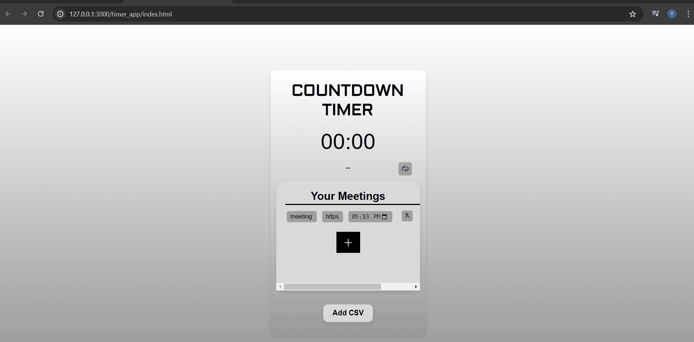
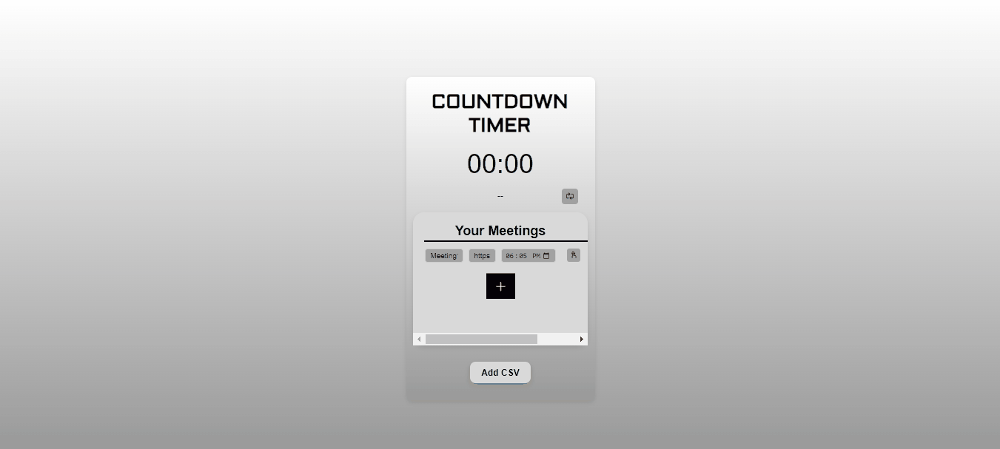

# Countdown Timer User Manual

## Overview

This manual provides instructions on how to use the Countdown Timer, a versatile web application designed to help manage time effectively with customizable time blocks for different tasks. It is particularly useful for those who attend online meetings, as the timer includes a feature to countdown to your next meeting. Once the countdown hits zero, it automatically redirects you to the specified meeting link and provides a notification 10 seconds before the meeting starts, ensuring you're always on time.

## Getting Started

### Opening the Application
To open the Countdown Timer application on your computer, follow these steps:

1. Download the zip file from the GitHub repository or clone it. Once downloaded, right-click on the zip file and select `Extract All...` or `Unzip` to extract the contents into a folder.
1. Navigate to the folder where you extracted the files. The folder will typically be named similar to the zip file.
3. Locate the file named `index.html`.
4. Double-click on `index.html` to open it in your default web browser.

### Features
Once you have opened the application, you can begin using its features as described below.

#### Adding a Time Block
To add a time block:
- Click the `Add` button to create the time block.
- Enter the task name in the designated field.
- Set the desired time for the task.

#### Playing and Pausing a Timer
- To start the timer, click the `Play` button.
- To pause the timer, click the `Pause` button while the timer is running.

#### Deleting a Time Block
- Click the `Delete` button next to the time block you wish to remove.

#### Extending a Time Block 
- Click on 'Extend' button next to the Delete button to extend the current timer with 30 seconds.

#### Advancing a Time Block
- Click the 'Advance' button next to the extend button to move to the next time block.

## Importing Time Blocks

Our Countdown Timer allows you to import time blocks and their corresponding durations in minutes from a CSV file. To ensure successful import, your CSV file should be formatted as follows:

| Task   | Minutes |
| ------ | ------- |
| task1  | 1       |
| task2  | 2       |
| ...    | ...     |

### CSV File Format

- The first column should contain the name of the task with the header "Task".
- The second column should list the duration in minutes with the header "Minutes".
- Each subsequent row should list a new task and its duration.

### How to Import

1. Prepare your CSV file according to the format above.
2. In the Countdown Timer application, click on the `Add CSV` button.
3. Select your CSV file and confirm the import to populate your time blocks.

Make sure your CSV file does not contain any additional headers or footers; it should only contain data as shown in the example table above.

## Toggling Between Time Blocks and Online Meetings

To switch your view between your list of time blocks and the online meetings setup:

1. Locate the toggle button on the main interface of the application.

2. Click the toggle button to change the view:
    - If you are viewing your time blocks, clicking the button will switch the container to display online meetings.
    - If you are in the online meetings view, clicking the button will take you back to your time blocks.

## Adding Online Meetings

The Countdown Timer also facilitates the scheduling of online meetings. You can add a new meeting to your list and the timer will remind you when it's time to join.

### How to Add a New Online Meeting

1. Ensure you are in the "Online Meetings" view by using the toggle button to switch containers if necessary.

2. Click the `Add` button located inside the meetings container.

3. A form will appear prompting you to enter the details of the meeting. Fill in the following information:
    - **Meeting Name**: Enter a descriptive name for your meeting to easily identify it later.
    - **Meeting Link**: Paste the URL for the online meeting. Ensure it starts with `http(s)://` to guarantee it will open correctly in your browser.
    - **Date and Time**: Select the date and time when the meeting is scheduled to take place. 

## Starting the Countdown for a Scheduled Meeting

Once you have added an online meeting to the container, you can initiate the countdown to the start time of the meeting with the following steps:

1. In the "Online Meetings" container, locate the meeting for which you want to start the countdown.

2. Each meeting entry will have a `Select` button associated with it. Click the `Select` button in the row of the meeting you wish to join. This action will activate the countdown timer for that specific meeting.

3. The countdown will now display on the screen, showing the remaining time until the meeting starts. Make sure your sound is on or notifications are enabled so that you can hear the alert when the meeting time is approaching.

4. When 10 seconds are remaining to start the meeting, pop-up notification will come which shows "Meeting starts in 10 seconds". 

5. At the end of the countdown, the application will automatically open the provided meeting link, connecting you to your scheduled meeting promptly.

### How to join and delete meeting

1. Ensure you are in the "Online Meetings" view by using the toggle button to switch containers if necessary.

2. Firstly, start the timer of the meeting and than click on the join meeting button which allows user  
   to join the meeting instantly instead of waiting the timer to finish and get redicted to the link.

   

3. To delete the meeting click on the delete button.
    
   

## Troubleshooting
If you encounter any issues while using the Countdown Timer, consider the following tips:
- Ensure your web browser is up to date.
- Check if JavaScript is enabled as it is required for the timer functionalities.

## Support
For further assistance, please contact: harshpatel.adl@gmail.com

## Conclusion
Thank you for using the Countdown Timer. We hope it helps you manage your time more effectively!

